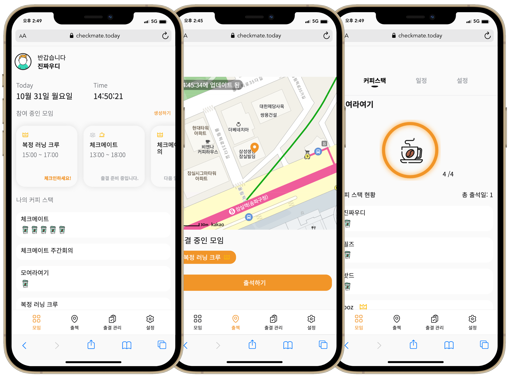

<h1>체크메이트</h1>

<strong>체크메이트</strong>는 출석 체크와 지각 이력 관리를 간편하게 해주는 서비스입니다.

사람이 직접 출석 체크를 하고, 지각 횟수를 관리한다는 것은 누락되기도 쉽고 번거로운 일입니다.

그래서 체크메이트는 출석 관리를 더 편하게 할 수 있도록 아래의 핵심 기능을 제공합니다.

<strong>일정 관리&nbsp;&nbsp;&nbsp;&nbsp;|&nbsp;&nbsp;&nbsp;&nbsp;GPS 기반 출석 체크&nbsp;&nbsp;&nbsp;&nbsp;|&nbsp;&nbsp;&nbsp;&nbsp;모임 출결 관리&nbsp;&nbsp;&nbsp;&nbsp;|&nbsp;&nbsp;&nbsp;&nbsp;지각에 따른 페널티 부여</strong>

## 서비스 미리보기

## 아키텍쳐

### 백엔드

## 기술 스택

### 프론트엔드

### 백엔드

## 팀원

|                    Backend                    |                    Backend                    |                      Backend                      |                       Backend                       |                       Backend                       |                       Frontend                        |                   Frontend                    |
| :-------------------------------------------: | :-------------------------------------------: | :-----------------------------------------------: | :-------------------------------------------------: | :-------------------------------------------------: | :---------------------------------------------------: | :-------------------------------------------: |
|  |    |  |      |    |    |    |
| [썬 (윤선용)](https://github.com/syoun602) | [포키 (권예진)](https://github.com/YJGwon) | [쿤 (홍동건)](https://github.com/Hongdonggeon) | [아스피 (신동석)](https://github.com/shindong96) | [필즈 (조성우)](https://github.com/progress0407) | [우디 (우정민)](https://github.com/greenblues1190) | [밧드 (감우영)](https://github.com/kamwoo) |
